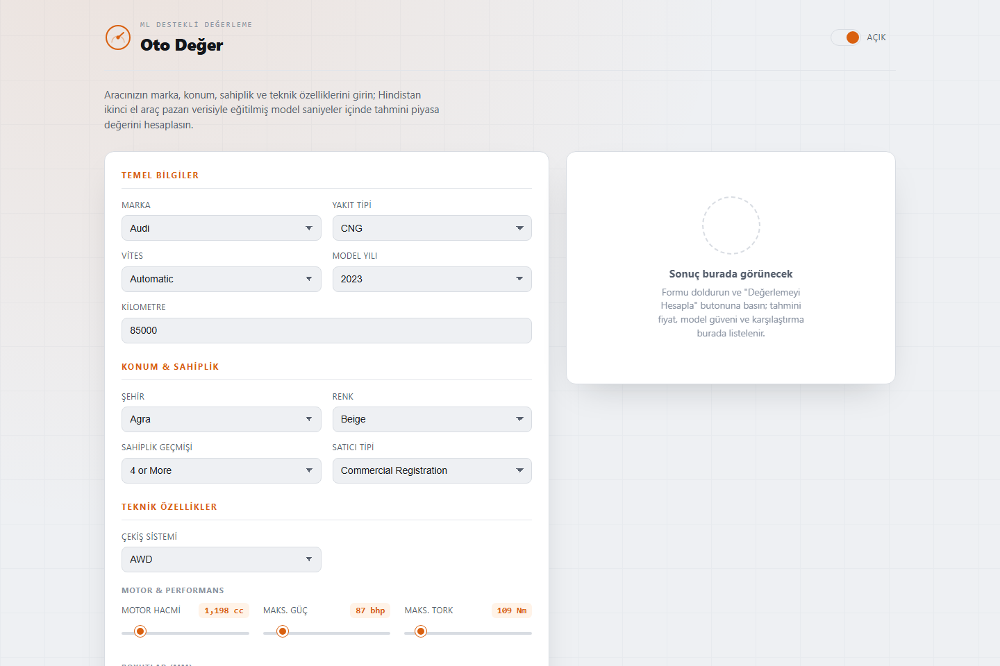

# Araba Fiyat Tahmini — Used Car Price Predictor


> A FastAPI web app that predicts used-car prices from real second-hand market listings, using a GradientBoostingRegressor trained on 18 real vehicle features — with a dashboard-style dark UI built for late-night showroom vibes.

## Screenshot



## Features

- **Live price prediction** from a trained `GradientBoostingRegressor`, not a lookup table or a hardcoded estimate
- **18 real input features** covering identity (brand, fuel type, transmission), condition (year, kilometers, owner count, seller type), and mechanical specs (engine cc, max power, max torque, drivetrain, dimensions, seating, fuel tank capacity)
- **Genuine model accuracy reported to the user** — the API returns the model's real test-set R², replacing an earlier version of this project that returned a fixed, made-up `confidence: 0.84` regardless of input
- **Feature importance breakdown** so you can see which inputs actually move the predicted price
- **Brand-level price comparison** — average price and listing count for the selected brand, pulled from the dataset
- **Dashboard-themed frontend** — animated odometer-style price counter and a speedometer-style gauge for the model's R², built with vanilla JS and Jinja2 templates

## Dataset & Model

The model is trained directly from `car details v4.csv`, a real second-hand car market dataset with **2,059 listings**. Compound string fields like `"87 bhp @ 6000 rpm"` and `"1198 cc"` are parsed with regex into clean numeric features (`max_power_bhp`, `engine_cc`, `max_torque_nm`) before training.

**18 features used by the model:**

| Category | Features |
|---|---|
| Identity | brand, fuel type, transmission |
| Usage | year, kilometers, owner count, seller type |
| Location & appearance | location, color |
| Drivetrain & engine | drivetrain, engine cc, max power (bhp), max torque (Nm) |
| Dimensions | length, width, height, seating capacity, fuel tank capacity |

**Model:** `GradientBoostingRegressor` (scikit-learn, 200 estimators), trained with an 80/20 train/test split.

**Test-set R² ≈ 0.89** — computed live at startup with `sklearn.metrics.r2_score` on the held-out test set and returned by the `/predict` endpoint as `model_r2`. This replaces a previous hardcoded `confidence: 0.84` value that didn't reflect actual model performance.

## Tech Stack

| Category | Tools |
|---|---|
| Backend | FastAPI, Uvicorn |
| ML / Data | scikit-learn, pandas, NumPy |
| Templating | Jinja2 |
| Frontend | Vanilla JS, HTML/CSS (animated odometer + gauge UI) |
| Containerization | Docker |

## Run Locally

**Prerequisites**: Python 3.11+

```bash
git clone https://github.com/ErdoganPeker/Araba-Fiyat-Tahmini.git
cd Araba-Fiyat-Tahmini/app

python -m venv .venv
.venv\Scripts\activate      # Windows
# source .venv/bin/activate # macOS/Linux

pip install -r requirements.txt
python main.py
```

The app trains the model on startup and serves the dashboard at **http://localhost:5005**.

### Run with Docker

```bash
docker build -t araba-fiyat-tahmini .
docker run -p 8000:8000 araba-fiyat-tahmini
```

The containerized app is served at **http://localhost:8000**.

## Project Structure

```
Araba-Fiyat-Tahmini/
├── app/
│   ├── main.py              # FastAPI app: preprocessing, training, /predict endpoint
│   ├── requirements.txt
│   └── templates/           # Jinja2 dashboard UI
├── car details v4.csv       # Real used-car market dataset (2,059 listings)
├── car-price-prediction(1).ipynb  # Exploratory analysis & model comparison notebook
├── best_model(1).pkl        # Previously trained model artifact
├── model_results(2).csv     # Comparative results across candidate models
└── Dockerfile
```

## Developer

**Erdoğan Yasin Peker**
[GitHub](https://github.com/ErdoganPeker) · [LinkedIn](https://www.linkedin.com/in/erdogan-yasin-peker-b107ba24b/)
